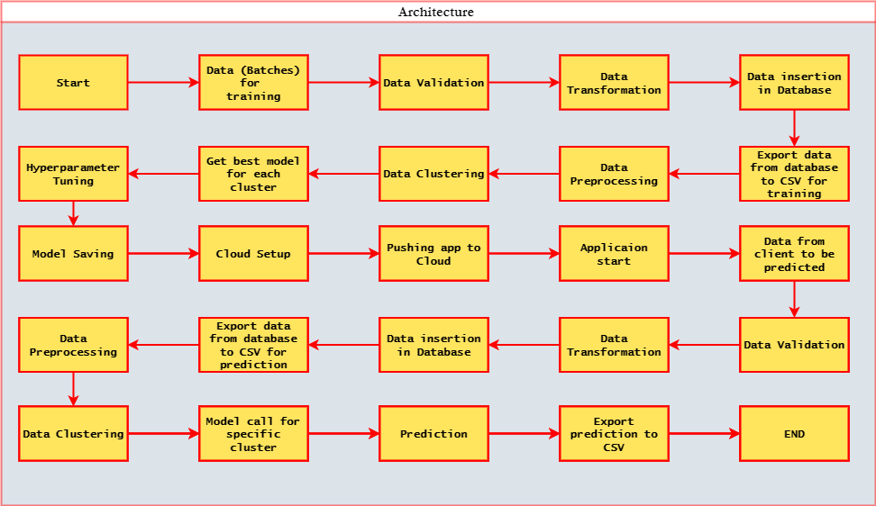

# Wafer Fault Detection


 
---

## About

### An end-to-end machine learning project for detecting faults in wafer sensor

> **Wafer** is a thin slice of semiconductor material, typically silicon, used in the production of integrated circuits [more↗](https://en.wikipedia.org/wiki/Wafer_(electronics)#:~:text=In%20electronics%2C%20a%20wafer%20(also,in%20and%20upon%20the%20wafer.)). Sensors in wafer can get damaged which may lead to faulty wafers, depending on the cruciality of the sensor damaged the wafer may need rework process.

## Business Problem

> Manufacturing of wafer involves many steps. At the end of the process, the wafer is tested for any faults. If the wafer fails any test, The entire production has to be stopped and manual inspection is required to find the faulty wafer. The Faulty wafer is then sent to the rework process. The rework process is very expensive and time consuming. So, it is very important to detect the faults in the wafer before sending it to the rework process. If there is some way to identify faulty wafers, quickly and effectively; it would increase the efficiency and profit of the business.

## Modelling a data science problem

---

### 1. Problem Definition

> The inputs of various sensors for different wafers have been provided. The task is to build a machine learning model that can predict whether the wafer is faulty or not and thus identify the wafers that need to be sent to the rework process. The end user require a web interface from which they could upload the sensor data and get the predictions. End user is not responsible for maintaining or retraining of the model.

### 2. Data

> The data is obtained as batches to a fixed location. The data contains the Wafer names and different sensor values for each wafer. The last column will have `-1 or 1` values. The `-1` values indicate that the wafer is not defective and the `1` values indicate that the wafer is defective. Apart from this data, the client would also provide the schema which contain information like **Name of the files, Length of Date value in FileName, Length of Time value in FileName, Number of Columns, Name of the Columns, and their datatype.**

**The dataset is obtained from [zenodo](https://zenodo.org/record/4322353#.Y7K4y3ZBytU).**

### 3. Solution

> The solution is to build a machine learning model that can predict whether the wafer is faulty or not and thus identify the wafers that need to be sent to the rework process. The model will be deployed on a web application.

## key Features

* __Data Preprocessing:__ Comprehensive data preprocessing to clean and prepare the dataset for model training.
* __Machine Learning Models:__ Implementation of various machine learning models for classification tasks.
* __Model Evaluation:__ Rigorous evaluation of model performance using relevant metrics.
* __Interactive Web Interface:__ Integration with an interactive web interface for easy interaction and predictions.

---

## Folder Structure

    |-- WaferFaultDetection_new/
    |-- application_logging/
        |-- logger.py
    |-- best_model_finder/
        |-- tuner.py
    |-- data_ingestion/
        |-- data_loader.py
        |-- data_loader_prediction.py
    |-- data_preprocessing/
        |-- clustering.py
        |-- preprocessing.py
    |-- file_operations/
        |-- __init__.py
        |-- file_methods.py
    |-- models/
        |-- [Model files go here]
    |-- PredictionArchivedBadData/
        |-- __init__.py
    |-- Prediction_Batch_files/
        |-- __init__.py
    |-- Prediction_Database/
        |-- __init__.py
    |-- Prediction_FileFromDB/
        |-- __init__.py
    |-- Prediction_Logs/
        |-- __init__.py
        |-- columnValidationLog.txt
        |-- DataBaseConnectionLog.txt
        |-- dataTransformLog.txt
        |-- DbInsertLog.txt
        |-- DbTableCreateLog.txt
        |-- ExportToCsv.txt
        |-- GeneralLog.txt
        |-- missingValuesInColumn.txt
        |-- nameValidationLog.txt
        |-- Prediction_Log.txt
    |-- Prediction_Output_File/
        |-- __init__.py
    |-- Prediction_Raw_Data_Validation/
        |-- predictionDataValidation.py
    |-- preprocessing_data/
        |-- [Preprocessing data files go here]
    |-- templates/
        |-- index.html
    |-- TrainingArchiveBadData/
        |-- __init__.py
    |-- Training_Batch_Files/
        |-- __init__.py
    |-- Training_Database/
        |-- __init__.py
    |-- Training_FileFromDB/
        |-- __init__.py
    |-- Training_Logs/
        |-- __init__.py
        |-- columnValidationLog.txt
        |-- DataBaseConnectionLog.txt
        |-- dataTransformLog.txt
        |-- DbInsertLog.txt
        |-- DbTableCreateLog.txt
        |-- ExportToCsv.txt
        |-- GeneralLog.txt
        |-- missingValuesInColumn.txt
        |-- ModelTrainingLog.txt
        |-- nameValidationLog.txt
        |-- Training_Main_Log.txt
        |-- valuesfromSchemaValidationLog.txt
    |-- Training_Raw_data_validation/
        |-- rawValidation.py
    |-- Training_Raw_files_validated/
        |-- [Validated raw files go here]
    |-- main.py
    |-- manifest.yml
    |-- predictFromModel.py
    |-- prediction_Validation_Insertion.py
    |-- Procfile
    |-- requirements.txt
    |-- runtime.txt
    |-- schema_prediction.json
    |-- schema_training.json
    |-- test.py
    |-- trainingModel.py
    |-- training_Validation_Insertion.py|-- WaferFaultDetection_new/
    |-- application_logging/
        |-- logger.py
    |-- best_model_finder/
        |-- tuner.py
    |-- data_ingestion/
        |-- data_loader.py
        |-- data_loader_prediction.py
    |-- data_preprocessing/
        |-- clustering.py
        |-- preprocessing.py
    |-- file_operations/
        |-- __init__.py
        |-- file_methods.py
    |-- models/
        |-- [Model files go here]
    |-- PredictionArchivedBadData/
        |-- __init__.py
    |-- Prediction_Batch_files/
        |-- __init__.py
    |-- Prediction_Database/
        |-- __init__.py
    |-- Prediction_FileFromDB/
        |-- __init__.py
    |-- Prediction_Logs/
        |-- __init__.py
        |-- columnValidationLog.txt
        |-- DataBaseConnectionLog.txt
        |-- dataTransformLog.txt
        |-- DbInsertLog.txt
        |-- DbTableCreateLog.txt
        |-- ExportToCsv.txt
        |-- GeneralLog.txt
        |-- missingValuesInColumn.txt
        |-- nameValidationLog.txt
        |-- Prediction_Log.txt
    |-- Prediction_Output_File/
        |-- __init__.py
    |-- Prediction_Raw_Data_Validation/
        |-- predictionDataValidation.py
    |-- preprocessing_data/
        |-- [Preprocessing data files go here]
    |-- templates/
        |-- index.html
    |-- TrainingArchiveBadData/
        |-- __init__.py
    |-- Training_Batch_Files/
        |-- __init__.py
    |-- Training_Database/
        |-- __init__.py
    |-- Training_FileFromDB/
        |-- __init__.py
    |-- Training_Logs/
        |-- __init__.py
        |-- columnValidationLog.txt
        |-- DataBaseConnectionLog.txt
        |-- dataTransformLog.txt
        |-- DbInsertLog.txt
        |-- DbTableCreateLog.txt
        |-- ExportToCsv.txt
        |-- GeneralLog.txt
        |-- missingValuesInColumn.txt
        |-- ModelTrainingLog.txt
        |-- nameValidationLog.txt
        |-- Training_Main_Log.txt
        |-- valuesfromSchemaValidationLog.txt
    |-- Training_Raw_data_validation/
        |-- rawValidation.py
    |-- Training_Raw_files_validated/
        |-- [Validated raw files go here]
    |-- main.py
    |-- manifest.yml
    |-- predictFromModel.py
    |-- prediction_Validation_Insertion.py
    |-- Procfile
    |-- requirements.txt
    |-- runtime.txt
    |-- schema_prediction.json
    |-- schema_training.json
    |-- test.py
    |-- trainingModel.py
    |-- training_Validation_Insertion.py

### Architecture



### Installation

Install my-project with git

```bash
  git clone https://github.com/Mahesh-martian/Wayfer_fault_detectiion.git

  cd wafer-fault-detection
  
  pip install -r requiremenrs.txt
  
```

## Run the application

`python main.py`

open any browser and enter the url

```
http://127.0.0.1:5000
```

## Contributing

If you'd like to contribute to the project, please follow our contributing guidelines

## Author

Mahesh Kumar R

LinkedIn Profile - [LinkedIn Profile](https://www.linkedin.com/in/mahesh-kumar-r/)

For detailed Project Explaination video -[click here ](https://youtu.be/hXVvsEaUsBw)
